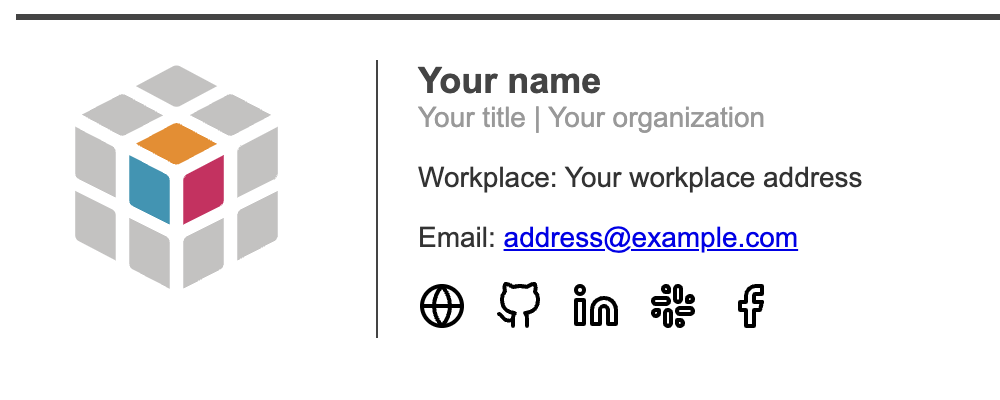
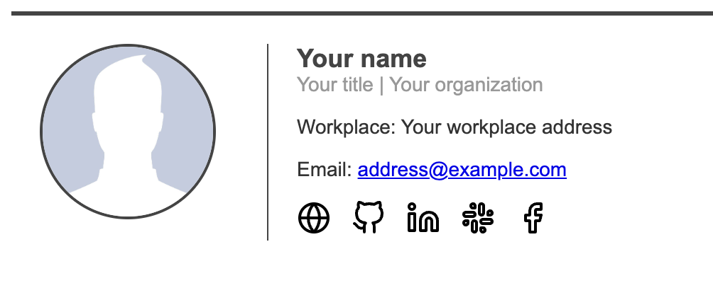
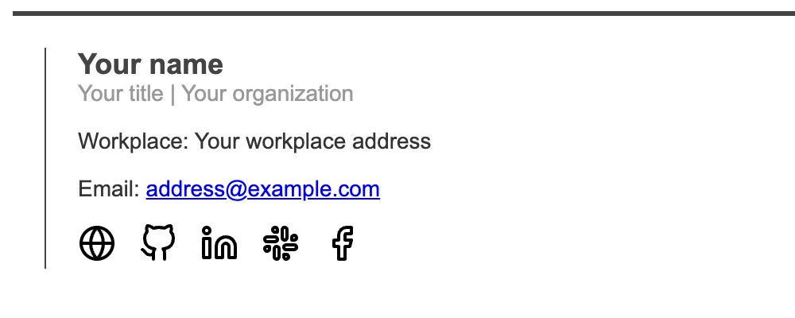

# Email-Signature-Generator

> A personal or professional email signature generator.

|  |  |
|:-----:|:-----:|

## Getting Started

### Prerequisites

* Python 3.11 or higher
* An editor that supports yaml files (like [Visual Studio Code](https://code.visualstudio.com/)).

### Install

To use this template, you can either download the zip file or clone the repository:

```bash
git clone https://github.com/MorganKryze/Email-Signature-Generator.git
```

In addition, you will need to install the following libraries in your python environment:

```bash
cd Email-Signature-Generator
pip install -r requirements.txt
```

### Usage

Once installed, it's pretty much it, just edit the `options.yml` file to your liking and execute this command to apply your changes:

```bash
python src/generate_signature.py
```

#### Photo & logo

To change the photo displayed in the signature, just replace the link with your own link, or the path to your custom image in the `assets` folder.

```yml
logo: https://raw.githubusercontent.com/MorganKryze/Email-Signature-Generator/main/src/assets/icons/fablab.svg
#photo: https://raw.githubusercontent.com/MorganKryze/Signature-Generator/main/src/assets/default.jpg
```

> [!NOTE]
> You can switch between a photo or a logo by commenting out the line you don't want to use with a `#`. Even more, if you do not want any of these, just comment out both lines.



> [!WARNING]
> the photo will be displayed by default if both are uncommented.

#### About

Here, **DO NOT** put a `#` at the beginning of the lines, just replace the text with your own. The organization url will be put in the logo and the email will be put in the mailto link.

```yml
name: Your name
title: Your title
organization_name: Your organization
organization_url: https://example.com
workplace: Your workplace address
email: address@example.com
```

#### Social media

To change the social media links, just replace the links with your own. If you don't want to display a social media, just comment it out with a `#` or replace the link with `None`.

```yml
social_media:
  website: https://example.com
  github: https://github.com/example
#  instagram: https://instagram.com/example
  linkedin: https://linkedin.com/in/example
  slack: https://slack.com/example
  facebook: https://facebook.com/example
  youtube: None #https://youtube.com/example
```

> [!NOTE]
> You can switch the order of the social media by changing the order of the lines.

### Supported social media

Here is the list of supported social media:

* Website
* Github
* Instagram
* Linkedin
* Slack
* Facebook
* Youtube

## License

This project is licensed under the MIT License - see the [LICENSE.md](LICENSE) file for details.
