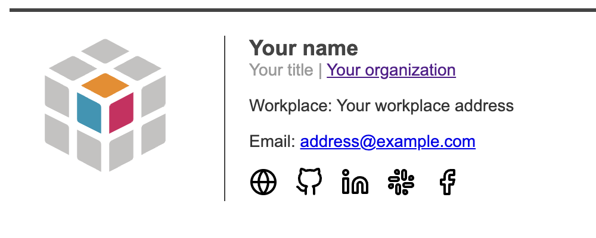

# Email-Signature-Generator

> A personal or professional email signature generator.

|  |  |
|:---:|:---:|

## Getting Started

### Prerequisites

To use this template, you will need any editor that can open a yml file (like [Visual Studio Code](https://code.visualstudio.com/) for example).

### Install

To use this template, you can either download the zip file or clone the repository:

```bash
git clone https://github.com/MorganKryze/Email-Signature-Generator.git
```

In addition, you will need to install the following libraries in your python environment:

```bash
cd Email-Signature-Generator
pip install -r requirements.txt
```

### Usage

Once installed, it's pretty much it, just edit the `options.yml` file to your liking and execute this command to apply your changes:

```bash
python src/generate_signature.py
```

Here are the different options you may want to change:

```yml
photo: https://raw.githubusercontent.com/MorganKryze/Signature-Generator/main/src/resources/default.jpg
```
*To change the photo displayed in the signature, just replace the link with your own link, or the path to your custom image in the assets folder.*

```yml
name: Your name
title: Your title
email: adress@example.com
workplace: Your workplace address
```
*To change the name, title, email or workplace, just replace the text with your own.*

```yml
social_media:
  website: https://example.com
  github: https://github.com/example
#  instagram: https://instagram.com/example
  linkedin: https://linkedin.com/in/example
  slack: https://slack.com/example
  facebook: https://facebook.com/example
  youtube: None #https://youtube.com/example
```
*To change the social media links, just replace the links with your own. If you don't want to display a social media, just comment it out with a `#` or replace the link with `None`.*

### Supported social media

Here is the list of supported social media:

* Website
* Github
* Instagram
* Linkedin
* Slack
* Facebook
* Youtube

## License

This project is licensed under the MIT License - see the [LICENSE.md](LICENSE) file for details.
